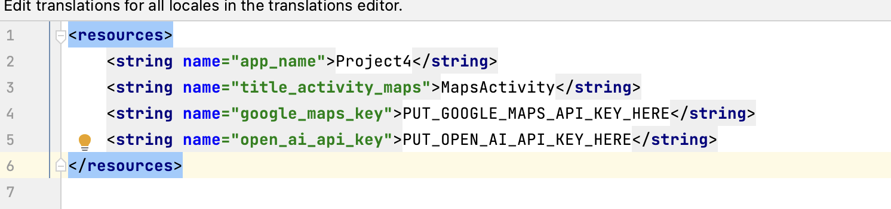
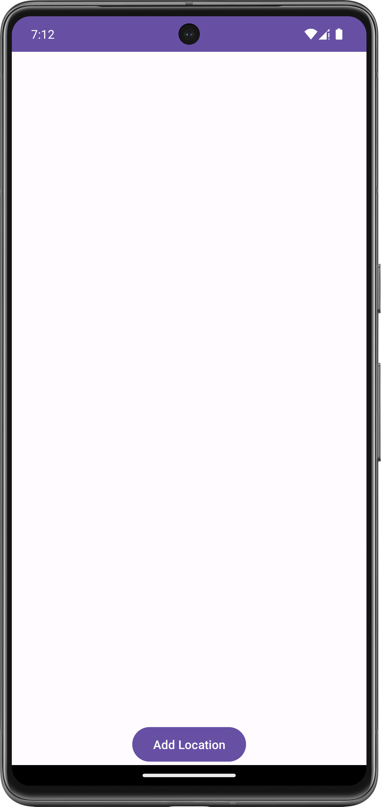
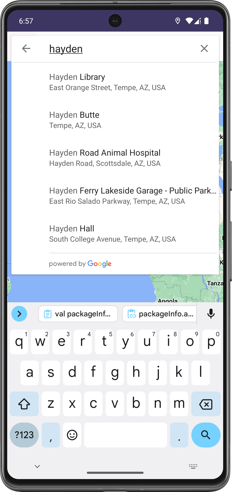
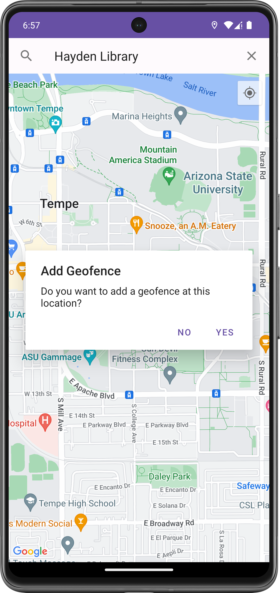
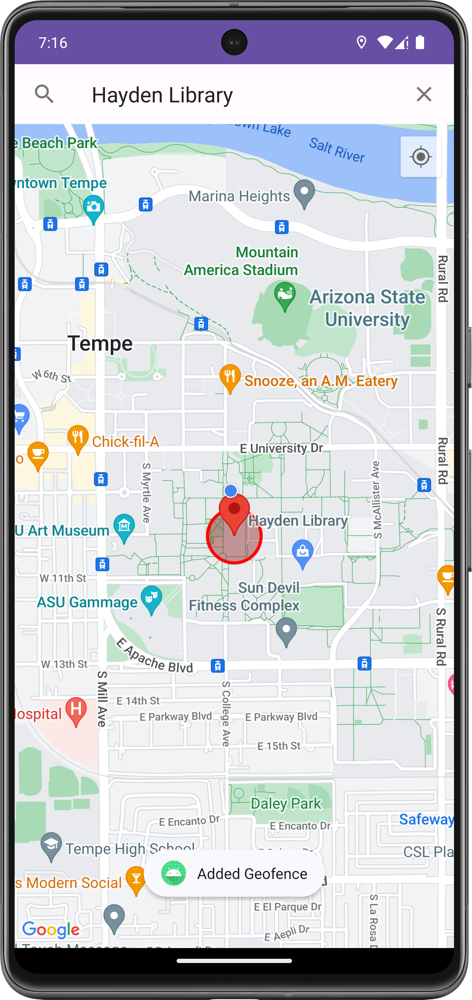
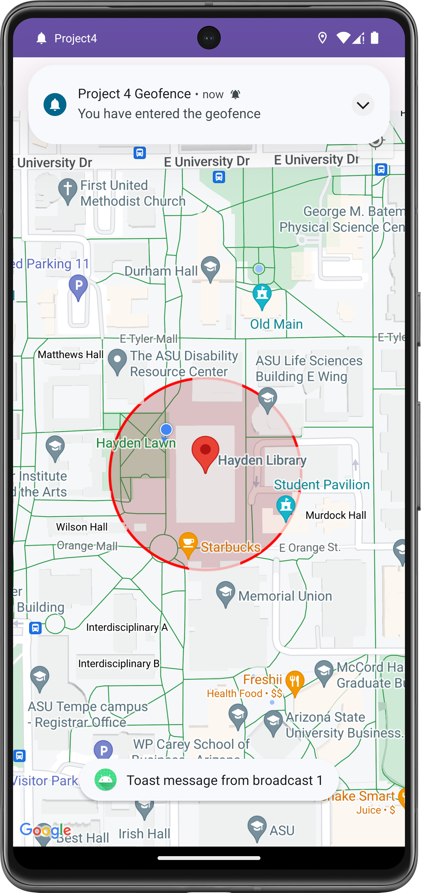
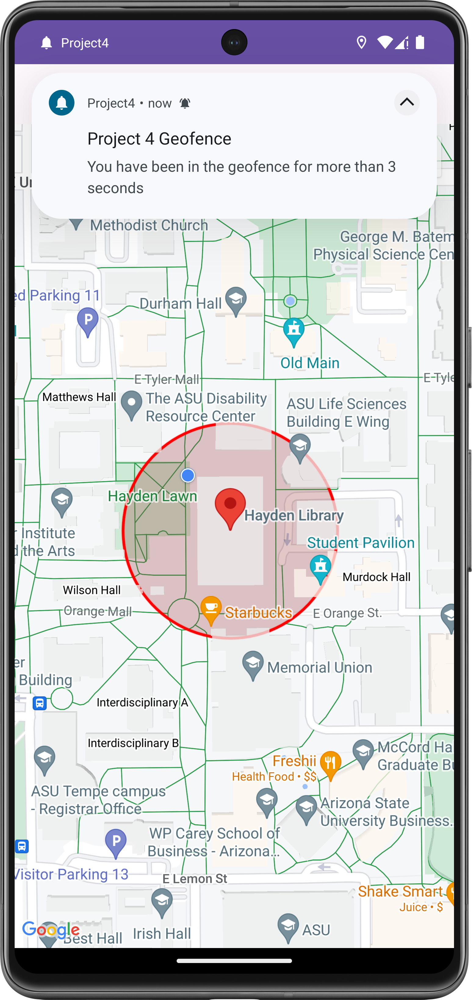
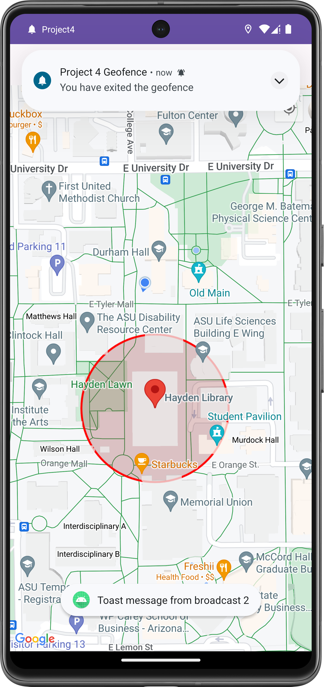
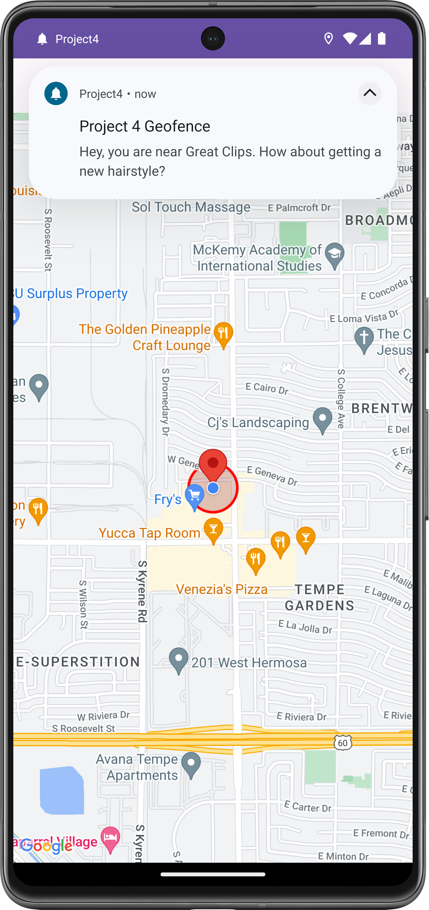
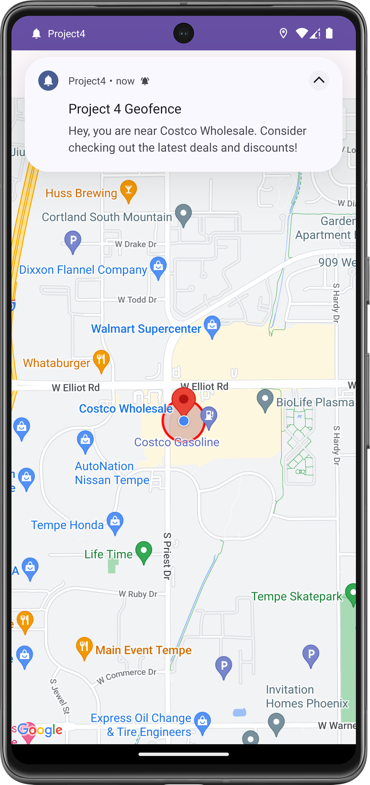

# CSE535 Tarun_Chinthakindi Project 4 Individual Contribution

Create a "strings.xml" file which has sensitive data like API Keys at the location app/res/values/strings.xml and create a string value named "google_api_key", "open_ai_api_key" and populate it with the Google Maps API key which you get from the Google Cloud console and Open AI API Key which you get from the Open AI as shown in the below figure.

Also, make sure to enable Places API on the GCP console for the proper functioning of the app.
and Enable Notifications for this current app in the settings page to see the Geofencing Triggering notifications like Enter, Exit, etc respectively when tested.
To Test the app:

There are two screens
1. App Usage Tracking
2. Add Geofences for the frequently visited places

Click on the button "App Usage Track" to navigate and view the App Usage Tracking

For the geofencing testing
1. Open the "Add Locations" screen and add a place where you want to set the geofence up.
   
   
  

2. Use the Search bar to search for the place where we want to set the geofence up
   
    
3. Go ahead and select "Yes" on the dialog box that appears to register the geofence at the selected place.

   

4. As we can see in the below picture, The geofence will be added successfully

   

5. If, we enter the geofence area using Emulator or physically to that location, we will receive the respective notifications like the one shown below

   

6. If the user stays within the geofence for a certain period of time, we call this event as "Dwell", as shown below the notification or the trigger happens

   

7. Finally, if the user exits the location, The EXIT event will be triggered

   

ChatGPT API Based location-aware and location relevant notification generation demo

 

As we can see, since it is Salon, we get the relevant notification message

And, since Costco is a super market, we have managed to show the relevant Geofence triggering message based on the location type
